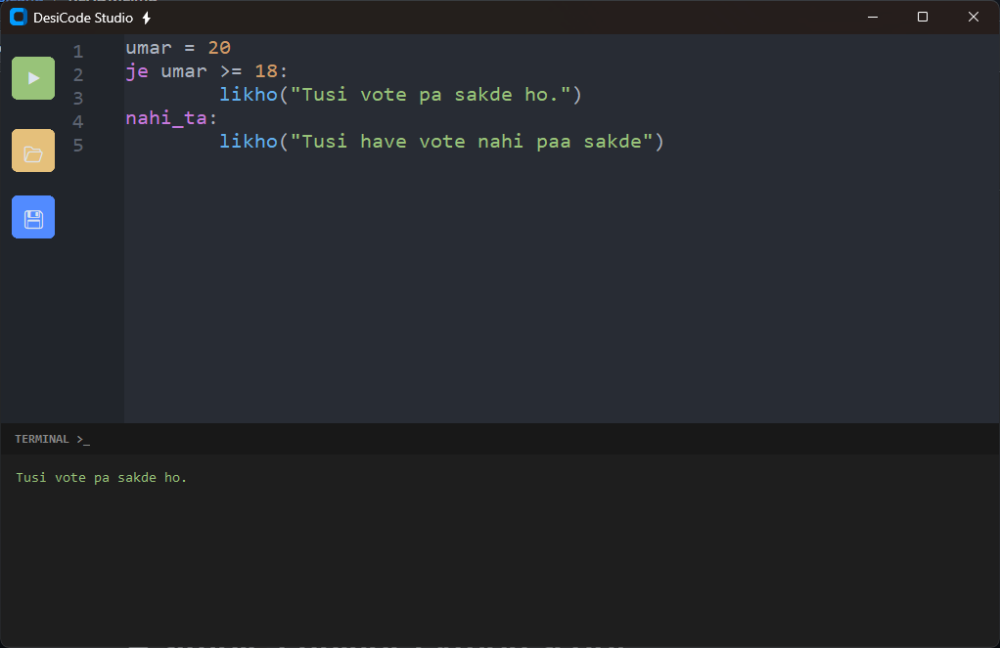

# DesiLang
DesiCode Studio ⚡ – A modern IDE and transpiler that lets you write, highlight, and execute Python code using Punjabi keywords.

Write Python, but make it Punjabi. 

DesiCode Studio is an educational and fun programming environment that allows you to write Python logic using Punjabi vocabulary. It features a custom-built transpiler and a sleek, dark-themed IDE designed to parse, highlight, and run your Desi code seamlessly.

---

## Demo



---

## 🚀 Features

* **Punjabi Transpiler (`core_punjabi.py`):** Translates Punjabi keywords (like `je`, `nahi_ta`, `likho`) into standard Python syntax on the fly and executes them.
* **Modern IDE (`modern_punjabi_ide.py`):** Built with `customtkinter`, featuring a beautiful "One Dark Pro" inspired UI.
* **Live Syntax Highlighting:** Automatically colors your Punjabi keywords, functions, strings, numbers, and comments.
* **Integrated Terminal:** See the output of your code (or catch those *Galtian*) right inside the app.
* **File Management:** Save and open your custom `.pb` (Punjabi) script files.

---

## 🛠️ Vocabulary Map
Here is a quick look at some of the keywords you can use:

| Punjabi Keyword | Python Equivalent |
| :--- | :--- |
| `likho` | `print` |
| `dasso` | `input` |
| `je` / `nahi_ta` | `if` / `else` |
| `jad_tak` | `while` |
| `waaste` / `wich` | `for` / `in` |
| `kamm` | `def` |
| `sahi` / `galat` | `True` / `False` |

---

# A simple Punjabi-Python script
```
ginti = 10
je ginti > 5:
    likho("Number wadda hai!")
nahi_ta:
    likho("Number chhota hai.")
```
